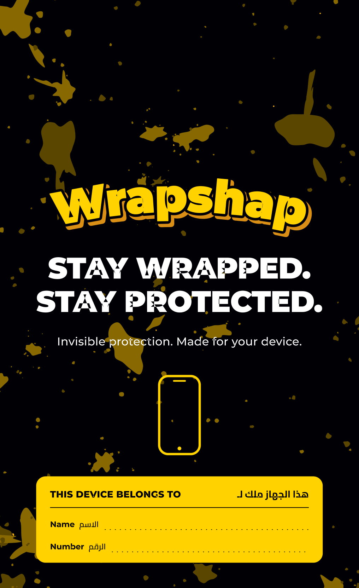

# Wrapshap — Phone Case Mailer

Print-ready artwork for the Wrapshap shockproof-case envelope.



---

## Files

| File | What it is |
|---|---|
| `print/Wrapshap_Envelope_Dieline_PRINT.ai` | **Send this to the printer.** Full flat blank, bleed, dieline, creases, glue areas, crop/registration marks, colour bar and job slug. |
| `print/Wrapshap_Envelope_Dieline_PRINT.pdf` | Identical bytes, `.pdf` extension — for anyone without Illustrator. |
| `print/Wrapshap_Envelope_FrontPanel.ai` / `.pdf` | Front panel alone at trim + 3 mm bleed. For mockups, social and single-panel repro. |
| `print/*_PROOF.png` | Flat screen proofs for sign-off. Approximations — not colour proofs. |
| `src/build_envelope.py` | The generator. Every dimension is a named constant at the top. |
| `src/typeset.py` | Shaping + outline engine (HarfBuzz → fontTools → vector paths). |

The `.ai` files are PDF-based, which is what Illustrator has written natively
since CS. Open them in Illustrator and everything is live, editable vector.

---

## Print specification

| | |
|---|---|
| Finished envelope | **123 × 205 mm** (portrait) |
| Flat blank | 149 × 455 mm |
| Document size | 177 × 483 mm (blank + 3 mm bleed + 11 mm slug) |
| Stock | 100 gsm wood-free (uncoated) |
| Printing | **4/0 process CMYK**, outside face only |
| Bleed | 3 mm on every edge |
| Safe area | 10 mm from any trim or crease |
| Finishing | die cut, then side- and bottom-pasted |
| Type | 100 % converted to outlines — no fonts to supply |
| Max total ink | 200 % |

### Dieline key

The three finishing channels are **spot separations**, not process build-ups,
so the die house can pull each as its own plate. All three are set to
overprint and carry no process ink.

| Swatch | Colour on screen | Meaning |
|---|---|---|
| `Dieline` | magenta | cut — the outer contour, radiused flap corners, thumb notch |
| `Crease` | cyan, dashed | fold — 2 horizontal, 2 vertical |
| `Glue` | green hatch | pasting areas — side flaps and the seal gum band |

To lift the dieline onto its own Illustrator layer: click any die rule,
**Select ▸ Same ▸ Stroke Colour**, then drag the selection to a new layer.

### Construction

Flat blank, top to bottom: **front panel → back panel → seal flap.**

1. Fold the two 13 mm side flaps back behind the front panel.
2. Fold the back panel up behind the front on the bottom crease; glue it to
   the side flaps.
3. The seal flap now sits above the opening and folds forward over the front.

The back panel artwork is set **180° round in the flat blank**. That is
deliberate — it swings over on the bottom crease, so artwork placed upright in
the flat would read upside down on the finished job.

A 11 mm thumb notch is die-cut into the front panel's opening edge. It sits
under the closed flap and is invisible until the envelope is opened.

---

## Colour

Black and yellow only. Every piece of white on the envelope is **unprinted
stock showing through** — no white ink.

| Role | C | M | Y | K | Ink |
|---|---|---|---|---|---|
| Rich black (flood) | 40 | 30 | 30 | 100 | 200 % |
| Brand yellow | 0 | 16 | 100 | 0 | 116 % |
| Gold (logo shadow, accents) | 0 | 32 | 100 | 2 | 134 % |
| Splatter, mid | 0 | 26 | 100 | 55 | 181 % |
| Splatter, dark | 0 | 22 | 100 | 78 | 200 % |
| Type | — | — | — | — | 0 % (paper) |

**One deliberate exception.** The *This device belongs to* block runs black
type on solid yellow rather than white on black. A pen does not show on a
flood-black ground, and those fields exist to be written on. It stays inside
the black-and-yellow palette. Say the word if you would rather have it white
on black and it is a two-line change.

---

## Typography

| Use | Face |
|---|---|
| Wordmark, headline | Montserrat Black |
| Panel headings | Montserrat ExtraBold |
| Field labels | Montserrat Bold |
| Supporting line | Montserrat Medium |
| Arabic | Cairo Bold / SemiBold |

Both families are SIL Open Font License 1.1 — free for commercial print. The
licence texts are bundled in `src/fonts/`. Because all type is outlined, the
printer needs nothing installed.

**On the wordmark:** it is a vector rebuild in the style of the reference pack
— arched, yellow, black keyline, gold drop. If you have the official Wrapshap
logo as `.ai`, `.eps` or `.svg`, drop it in and replace the single
`draw_logo()` call; nothing else in the layout depends on it.

---

## Rebuilding

```bash
pip install reportlab fonttools uharfbuzz pypdf pymupdf
python3 src/build_envelope.py
```

Output lands in `print/`. The splatter is procedurally generated from a fixed
seed (`SEED` in `build_envelope.py`), so rebuilds are byte-for-byte repeatable
— change the seed for a different scatter, or the geometry constants for a
different size.
