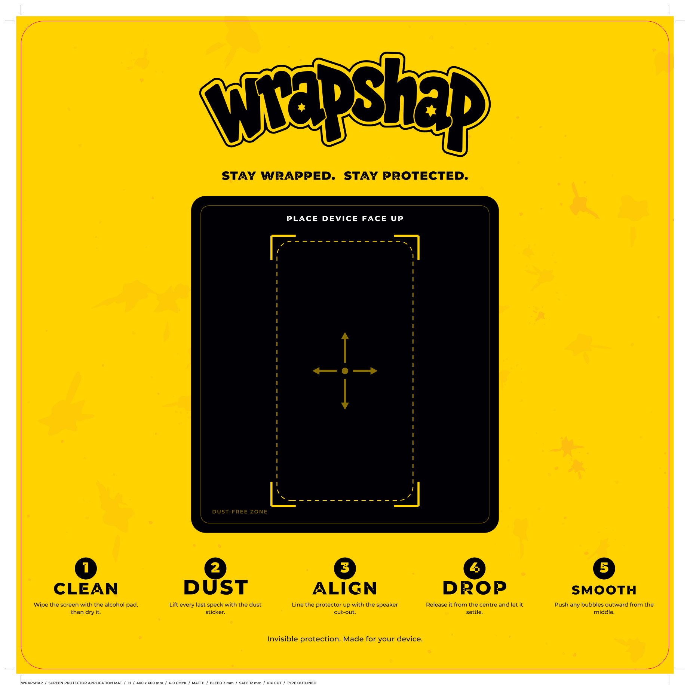

# Wrapshap — print artwork

Print-ready CMYK artwork for the Wrapshap range. Two products so far: the
phone-case mailer and the screen-protector application mat.

Everything is generated from source, so any dimension, colour or line of copy
is one constant away from being changed and rebuilt.

---

## Files

### Application mat — *place the phone, fit the protector*

| File | What it is |
|---|---|
| `print/Wrapshap_Mat_1x1_400x400mm_PRINT.ai` | **1:1 mat, 400 × 400 mm.** |
| `print/Wrapshap_Mat_16x9_600x337mm_PRINT.ai` | **16:9 mat, 600 × 337.5 mm.** |
| `print/Wrapshap_Mat_*_PROOF.png` | Flat proofs for sign-off. |



### Phone-case mailer

| File | What it is |
|---|---|
| `print/Wrapshap_Envelope_Dieline_PRINT.ai` | **Send this to the printer.** Full flat blank, bleed, dieline, creases, glue areas, marks, colour bar, slug. |
| `print/Wrapshap_Envelope_FrontPanel.ai` | Front panel alone at trim + bleed, for mockups. |

Every `.ai` has a `.pdf` twin with identical bytes, for anyone without
Illustrator. The `.ai` files are PDF-based, which is what Illustrator has
written natively since CS — open one and it is all live, editable vector.

---

## The mat

A counter mat for fitting a screen protector. The design is doing a job, not
just carrying a logo:

- **The work zone is black.** Dust shows against black and disappears against
  yellow. That is the whole reason the dark panel is there.
- **The device guide is dashed, with corner brackets** standing off it so both
  stay readable with a phone sitting in the middle.
- **Four arrows from a centre dot** — release the protector at the centre and
  push bubbles outward. The instruction is on the surface you are working on.
- **The five steps run in order** around the zone, and on the 16:9 the fitting
  kit drops into labelled zones in the order the steps call for them.

| | 1:1 | 16:9 |
|---|---|---|
| Finished | 400 × 400 mm | 600 × 337.5 mm |
| Document | 426 × 426 mm | 626 × 363.5 mm |
| Bleed | 3 mm | 3 mm |
| Safe area | 12 mm | 12 mm |
| Corner radius | 14 mm | 14 mm |
| Printing | 4/0 CMYK, matte | 4/0 CMYK, matte |

Both sizes are set as constants — say the word and they rescale to whatever
your mat supplier actually runs.

**Finish:** matte throughout. There is not a single gradient in the artwork;
every area is flat process colour, which is what keeps it looking matte under
shop lighting and stops the surface bouncing glare while someone is lining up
a protector.

**Substrate:** the artwork suits dye-sublimated fabric-top rubber, direct-print
PVC or a printed-and-laminated mat. Ask for a **matte** laminate or finish — a
gloss one will fight the design and the job.

---

## The mailer

| | |
|---|---|
| Finished envelope | 123 × 205 mm (portrait) |
| Flat blank | 149 × 455 mm |
| Document | 177 × 483 mm |
| Stock | 100 gsm wood-free (uncoated) |
| Printing | 4/0 process CMYK, outside face only |
| Bleed / safe | 3 mm / 10 mm |
| Finishing | die cut, then side- and bottom-pasted |

### Dieline key

The three finishing channels are **spot separations**, not process build-ups,
so the die house can pull each as its own plate. All three overprint and carry
no process ink.

| Swatch | On screen | Meaning |
|---|---|---|
| `Dieline` | magenta | cut — outer contour, radiused flap corners, thumb notch |
| `Crease` | cyan, dashed | fold — 2 horizontal, 2 vertical |
| `Glue` | green hatch | pasting areas — side flaps and the seal gum band |

To lift the dieline onto its own Illustrator layer: click any die rule,
**Select ▸ Same ▸ Stroke Colour**, drag to a new layer. The mats use the same
`Dieline` swatch for their rounded cut line.

### Construction

Flat blank, top to bottom: **front panel → back panel → seal flap.**

1. Fold the two 13 mm side flaps back behind the front panel.
2. Fold the back panel up behind the front on the bottom crease; glue it to the
   side flaps.
3. The seal flap now sits above the opening and folds forward over the front.

The back panel artwork is set **180° round in the flat blank**. That is
deliberate — it swings over on the bottom crease, so artwork placed upright in
the flat would read upside down on the finished job. Don't let anyone
"fix" it.

An 11 mm thumb notch is die-cut into the front panel's opening edge. It sits
under the closed flap and is invisible until the envelope is opened.

---

## Colour

Black and yellow only, across both products. Every piece of white is
**unprinted substrate showing through** — there is no white ink anywhere.

| Role | C | M | Y | K | Ink |
|---|---|---|---|---|---|
| Rich black | 40 | 30 | 30 | 100 | 200 % |
| Brand yellow | 0 | 16 | 100 | 0 | 116 % |
| Gold (keyline, accents) | 0 | 32 | 100 | 2 | 134 % |
| Deep gold | 0 | 42 | 100 | 14 | 156 % |
| Mat texture, light | 0 | 21 | 100 | 0 | 121 % |
| Mat texture, deep | 0 | 27 | 100 | 0 | 127 % |
| Splatter on black, mid | 0 | 26 | 100 | 55 | 181 % |
| Splatter on black, dark | 0 | 22 | 100 | 78 | 200 % |

Nothing exceeds **200 % total ink**, which is what uncoated 100 gsm and
dye-sub substrates take without set-off.

The mailer is black-dominant and the mat is yellow-dominant, on purpose — the
pack reads as the product and the mat reads as the workspace. If you want the
mailer flipped to a yellow ground to match the mat, that is a small change.

**One deliberate exception to "white type".** The mailer's *This device belongs
to* block runs black type on solid yellow. A pen does not show on a
flood-black ground, and those fields exist to be written on.

---

## The logo

`src/logo/wrapshap-wordmark-mono.png` is your supplied artwork. It is **traced
to bezier contours at build time** rather than placed as a raster, so the mark
is true vector at any size with no resolution ceiling — at 180 mm wide on the
mat, the bitmap on its own would have printed at around 240 dpi.

The trace recovers the wordmark's three layers from the nesting depth of the
contours, which is what lets each one be recoloured independently:

- **On black** (mailer): gold keyline, paper gap, yellow cores — matching your
  colour artwork.
- **On yellow** (mat): solid black, with the gap and the star cut-outs dropping
  out to the mat ground.

Shape is untouched either way. If you later have the wordmark as `.ai`, `.eps`
or `.svg`, drop it in and it will be sharper still at the hairline joints —
nothing else in the layouts depends on it.

---

## Typography

| Use | Face |
|---|---|
| Headline, step numbers | Montserrat Black |
| Panel and step headings | Montserrat ExtraBold |
| Labels | Montserrat Bold |
| Body | Montserrat Medium |
| Arabic | Cairo Bold / SemiBold |

Both families are SIL Open Font License 1.1 — free for commercial print, and
the licence texts are bundled in `src/fonts/`. All type is converted to
outlines, so the printer needs nothing installed. Verified on every file: zero
text-showing operators, zero RGB, no embedded fonts.

---

## Rebuilding

```bash
pip install reportlab fonttools uharfbuzz pypdf pymupdf potracer pillow numpy
python3 src/build_mat.py        # both mats
python3 src/build_envelope.py   # mailer
```

| Module | Job |
|---|---|
| `src/brand.py` | Palette, spot channels, fonts, type helpers |
| `src/typeset.py` | HarfBuzz shaping → fontTools contours → vector outlines |
| `src/logomark.py` | Traces the supplied wordmark, recovers its layers |
| `src/texture.py` | The paint-splatter engine |
| `src/build_mat.py` | The two mats |
| `src/build_envelope.py` | The mailer and its dieline |

Texture is procedural from a fixed seed (`SEED`), so rebuilds are repeatable —
change the seed for a different scatter.
